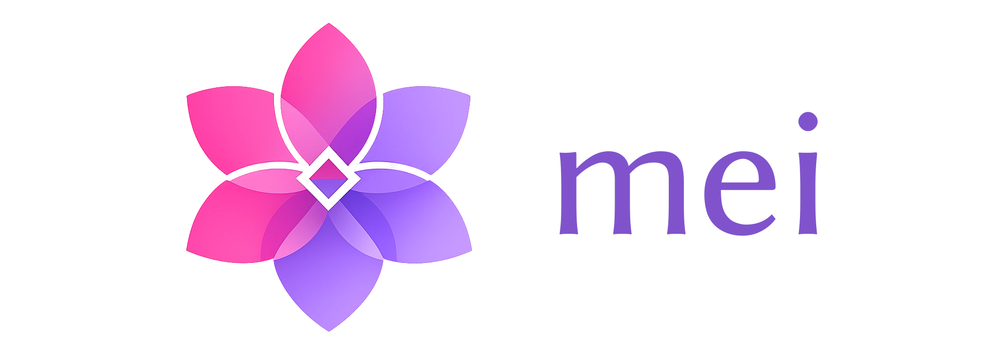

---

Out of nowhere I got a strong desire of building something powerful, meaningful and educational for myself. I had no choice but to create my own programming language.

I went straight up to Youtube and found [this wonderful playlist](https://youtube.com/playlist?list=PLUDlas_Zy_qC7c5tCgTMYq2idyyT241qs&si=Xyluj5YDMPhmQ14z), I headed to GitHub and [found gold too](https://github.com/DoctorWkt/acwj?tab=readme-ov-file). These will be my main resources to learn what I need to.

This repository is the documentation of my journey, which goal is to bootstrap mei compiler in mei.

This is the roadmap of the steps I have taken so far, feel free to check them out.
1. [Episode 0](docs/introduction.md): Introduction to the voyage and definition of the project

---

KVantage Copyright © 2026, kosail  
With love, from Honduras.