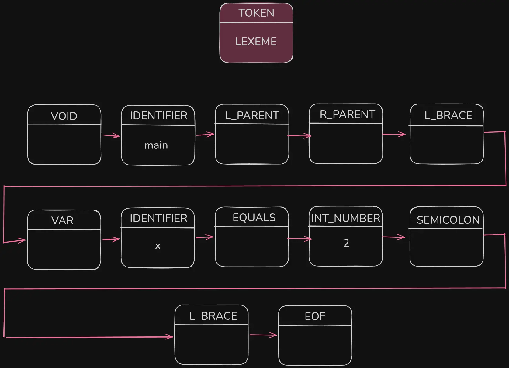
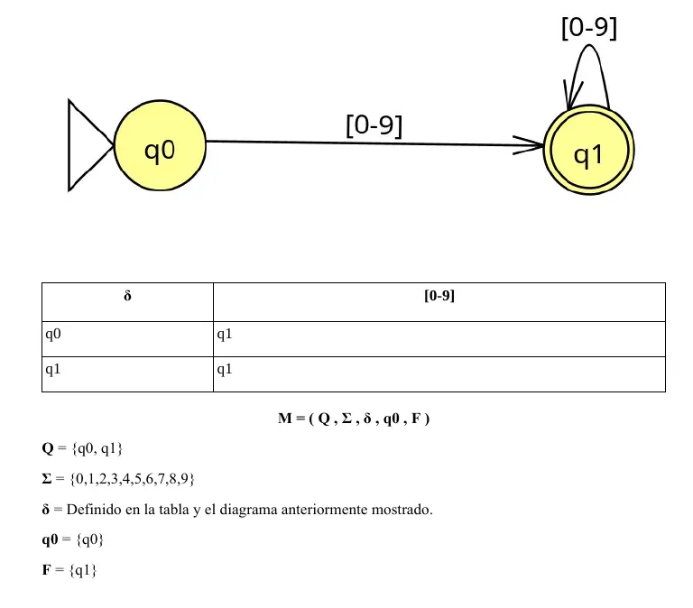
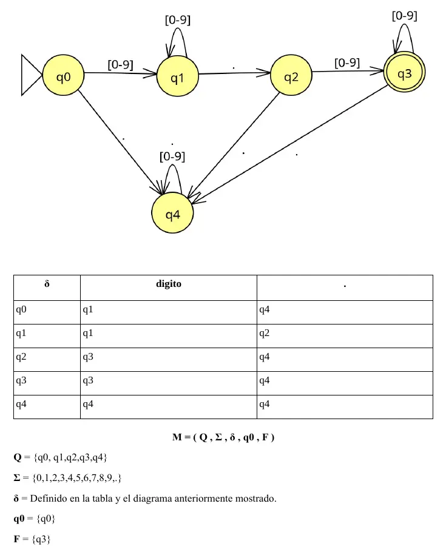

# Episode 2.1: Core concepts and Scanners (AKA lexical analyzers)
Let's start with a few concepts that we will require through this journey. I swear that I have like a week trying to remember this concepts and I ALWAYS forget about them. At college, I'm currently taking a compilers course and this is giving me troubles, so I decided to start this episode with what has bring me issues lately.

## Core Concepts
### 1. Lexemes and tokens
In simple words, **a token is a category. Is a classified chunk of characters that are recognized  as something meaningful**. Each token is a small, meaningful piece like a keyword, identifier, number, or symbol. For example:
```java
PLUS // + symbol, addition
MINUS // - symbol, substraction
EQUALS_TO // ==, compare to
IF // Conditional
WHILE // "while" reserved word to create loops
IDENTIFIER // Any variable name, any function name, like "myVar" or "myFunction"
INT_NUMBER // To identify integer numbers, like 123
FLOAT_NUMBER // To identify float numbers, like 1.4567
```

**A lexeme is the exact substring of the source code that matches a token structure** or rules to join that token category. Generally, we search and evaluate strings to see if it matches with one of our tokens using regular expressions. Examples of lexemes are the name of variables, the name of functions, the numeric values we store, etc.

So:

```
Token = Category
Lexeme = Actual text
```

<div style="margin-left: auto; margin-right: auto; width: fit-content;">

For example:
```
x = 10 + y
```

Means:


|Token|Lexeme|
|-----|----------|
|IDENTIFIER|x|
|INT_NUMBER|10|
|PLUS|+|

</div>

Notice that the token PLUS is always the + symbol. When we translate all this into code and we store the Token + the Lexeme, we don't need to really waste memory space storing tokens that we already know their value. Again, EQUALS_TO token will always be '==', and 'WHILE' token will always be 'while'.

Also, noticed that **lexers usually ignore spaces, line breaks and tabs**. Of course it is not a rule, but that's the usual based in C-style languages.

### 2. Expression vs Statement
- Expression -> returns something
- Statement -> does something

For example:

- 2 + 3		-----> Expression because it returns a value, which is 5.
- x = 5		-----> Statement because it does something, assigns 5 to x.

Functions can be expressions or statements depending on each actual programming language. I have doubts about this, would a expressions-only language be faster than a statements-only one? Although this is pretty interesting and important for real performance compilers design, I decided to keep on and not stay too much in small details like this. Otherwise, I would fall in the perfectionism (I have issues with this). Still, I wanted to know and I asked the AI to research for me, which, in a nutshell, replied this:

> “Expression vs statement” is a syntactic/semantic classification, not an execution model. It does not map to performance. Compilers erase the distinction early. No inherent performance advantage exists. Any difference comes from language semantics + compiler quality, not from the expression/statement distinction itself.

So, myth busted? 

### 3. Scanner, lexer or lexical analyzer
Remember how we just defined a "Token" minutes ago:

> A token is a category. Is a classified chunk of characters that are recognized  as something meaningful

So **a Lexer** is a program (or the portion of a compiler) that is in charge of reading an input of characters as a stream, and **return a list of tokens extracted from it**. It can read from a file or from the keyboard (standard input), doesn't matter. It read an input, returns tokens.

As a quick but more realistic example:

<div style="margin-left: auto; margin-right: auto; width: fit-content;">

#### Input:
What we see as:
```
void main() {
	var x = 2;
}
```
In memory is seen like this:

| v | o | i | d | SPACE | m | a | i | n | ( | ) | SPACE | { | \n |   |
|---|---|---|---|-------|---|---|---|---|---|---|-------|---|----|---|
| \t| v | a | r | SPACE | = | SPACE | 2 | ; | \n |   |   |   |   |   |
| } | EOF |   |   |   |   |   |   |   |   |   |   |   |   |   |

The lexer goes reading one by one, and should return a list of tokens. Something like this:




> Remember: the lexer ignores whitespaces, line breaks, tabs, etc.

</div>

---
## Theory behind scanners (AKA lexical analyzers)
According to my automaton's course teacher, you have two options. There might be more, of course, but she mentioned:

* Using regular expressions: Define an expression for each token, and then analyze each of text using all the defined expressions. That way, you get all the tokens. She categorized this as an elegant, but not a fine-grained way.
* Manually checking characters one by one: As we go reading char by char, we can adopt any of these two strategies:
1. Defining an automaton, fill a transition table, and then represent in in code using a Map<> of states. In this case, you define a variable that keeps track of the current "state" (the state determines whether it is a valid token or not), and you go reading the characters, comparing them to the map, and updating the state variable. 
    
    > You may noticed that I know not much about this method, because I had not code it yet. It is part of my upcoming assingments tho. Still, I will attach an example of two formal definitions of automatons I made in class:

<br/>
<details>
<summary>Deterministic Finite Automaton examples:</summary>
<br/>

I will not explain about automaton because that is a whole topic and I'm not really qualified to teach you about it. Sometimes, I can't even understand what my teacher is trying to explain.





<br/>

</details>

<br/>
<br/>

2. The manual way, manual checking. You define three pointers corresponding to the current line in the file, the start of the "word" we are reading, and the current position of the reader. For example:

```java
class Scanner {
	private int start = 0;
    private int current = 0;
    private int line = 1;

// advance, addToken and match function definitions is not included here,
// they and many others are the ones that handle the logic of going
// forward or backwards. I just want to depict the idea.

private void scanToken() {
	char currentChar = advance();

	switch(currentChar) {
		//...
		case '(': addToken(LEFT_PAREN); break;
		case ')': addToken(RIGHT_PAREN); break;
        case '!':
            addToken(match('=') ? BANG_EQUAL : BANG);
            break;
        case '=':
            addToken(match('=') ? EQUAL_EQUAL : EQUAL);
            break;
		//...
	}
}
```

Currently, I have decided to implement this second, manual way of checking characters one by one. It is not like I prefer this one, but is the one that I got to understand from Crafting Interpreters.

Due copyright I can't include the full code so you can get the idea, but I can explain to you the core ideas I understood from it, so you can build your own implementation.

## Actual implementation of a scanner/lexer
In essence, the scanner is a controlled loop over characters with three responsibilities: decide what pattern is being read, consume the right amount of input, and emit the correct token. The code you need to write must to do exactly that: walk through a string and builds a list of tokens step by step.

The scanner keeps three core positions as I mentioned before:

* `start` (where the current token begins)
* `current` (where you are right now)
* `line` (for error reporting). 

When you call the main method of the scanner (like, `getTokens()` or `scanTokens()`), the function must loops through the entire text source until the end is reached. For every new token, it sets `start = current`, then consumes characters to decide what kind of token is being read.

The main logic of this `getTokens()` method, lives in a switch on a single character (as the example snippet I shared with you before). Simple symbols like `(` or `+` are handled immediately. Some symbols can be one or two characters (`=`, `==`, `!=`), so the scanner looks ahead using a match helper function. This avoids consuming characters unless they actually form a valid combination.

Whitespace is ignored completely, except for newlines, which increment the line counter. Comments are also skipped by consuming characters until the end of the line. None of these produce tokens.

> Notice that in this book the author states that the created language Lox is very close to C-syntax family. Thus, tabs are ignored. If you are developing something like Python, then considering tabs as tokens take relevance.

Strings, numbers, and identifiers need more work. When a " is found, the scanner keeps advancing until it finds the closing " and captures everything in between as a string literal. Numbers are read by consuming digits, optionally handling decimals. Identifiers consume letters and digits (and `_`), then check if the result matches a reserved keyword using a map. If it does, it becomes a keyword token; otherwise, it’s just an identifier.

Aside from the discussed main method and the match helper function, we need more helper functions. Functions like `peek` and `peekNext` to be able to look ahead without consuming characters, while having an `advance` function that actually moves forward the `current` pointer. This separation is key cos with it **you control exactly when input is consumed**. Told ya, my teacher said it is fine-grained.

At the end, an `EOF` (End-of-file) token is added. This simplifies parsing later, since the parser always knows where the input ends.


## Next Episode: [Syntactical analysis](ep3_synt_analysis.md)

---

KVantage Copyright © 2026, kosail <br/>
With love, from Honduras.